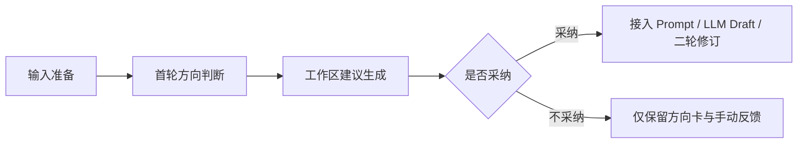

# 2026-07-21 产品线重做第一段闭环实现记录

## 1. 执行模式

- 执行方式：PI Engine 维护模式
- 依据文档：
  - `docs/architecture/AI封面创意助手产品线重做架构计划_v0.1.md`
  - `docs/prd/AI封面创意助手_MVP重做_主路径与工作台重做.md`
  - `docs/prd/AI封面创意助手重做_Requirement_Spec_v0.1.md`
- 本轮边界：
  - 不新建第二套前端工程
  - 不引入新运行时依赖
  - 不改动既有后端服务接口
  - 保留真实案例、复盘看板与导出工具资产

## 2. 第一段闭环范围

本轮实现的闭环为：



## 3. 核心实现

### 3.1 主路径文案收束

- 文件：`apps/web/public/index.html`
- 调整内容：
  - 首页定位从“实验验证”改为“产品线主路径工作台”
  - 三段流程改为“输入准备 / 方向判断 / 建议确认与二轮承接”
  - 工作区按钮改为“采纳并接入第二轮 / 不采纳本次建议”

### 3.2 工作区采纳门禁

- 文件：`apps/web/public/app/createApp.js`
- 调整内容：
  - 新增 `getAcceptedWorkspaceResult(state)`
  - Prompt 预览、LLM Draft、第二轮修订只读取已采纳的工作区建议
  - 工作区建议生成后将决策状态重置为待确认
  - 采纳 / 不采纳保存后同步二轮提示与按钮状态

### 3.3 三态反馈渲染

- 文件：`apps/web/public/app/renderers.js`
- 调整内容：
  - 无建议：提示生成工作区建议后再决策
  - 有建议未决策：提示采纳后才接入第二轮
  - 已采纳：提示已接入二轮
  - 已拒绝：提示不接入二轮，可按方向卡与手动反馈继续

### 3.4 操作态稳定

- 文件：`apps/web/public/styles.css`
- 调整内容：
  - 增加按钮禁用态
  - 固定工作区决策按钮最小宽度，减少状态文案变化造成的布局抖动

## 4. 验证口径

本轮应执行：

```bash
npm test
```

通过标准：

- 既有测试保持通过
- 工作区建议未采纳时，二轮修订不携带工作区结果
- 工作区建议采纳后，Prompt 预览、LLM Draft、二轮修订均可继承工作区结果
- 不采纳后界面明确展示“未接入”，且可继续按方向卡与手动反馈进入二轮

## 5. 后续建议

- 第二段闭环可继续进入“真实案例维护资产 -> 复盘看板 -> 下一轮规则修订”的维护模式。
- 若后续进入视觉重做，应先确认是否仍沿用当前静态前端架构，或升级为 React + TypeScript + Vite。
