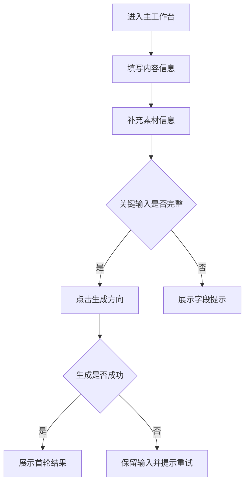
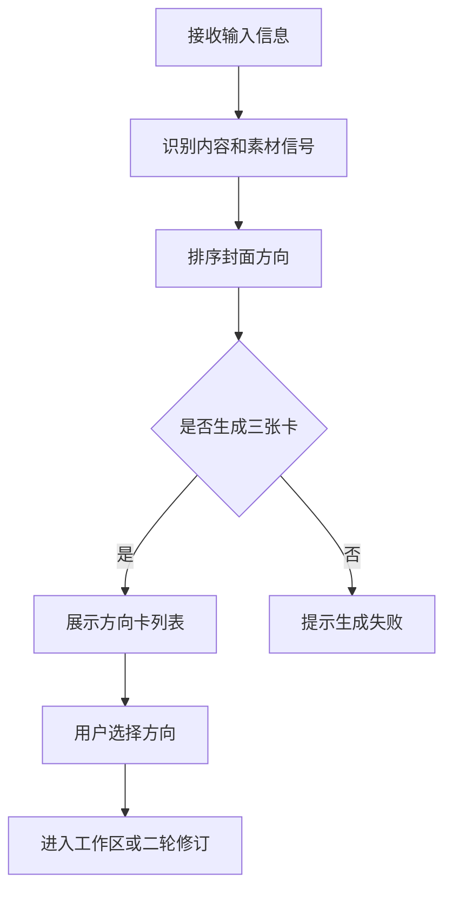
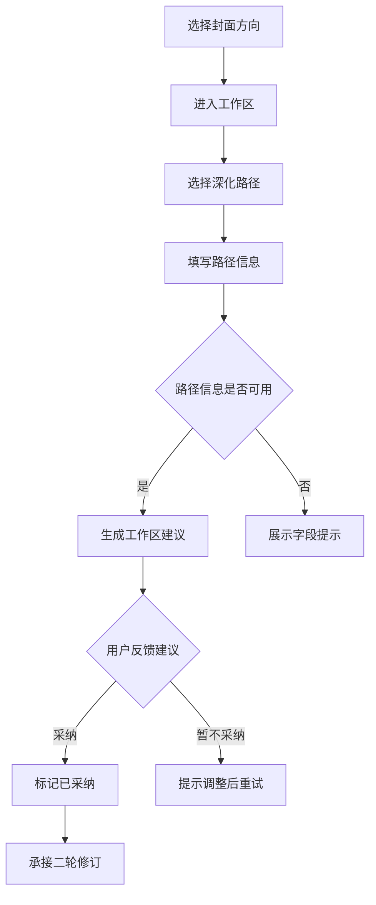
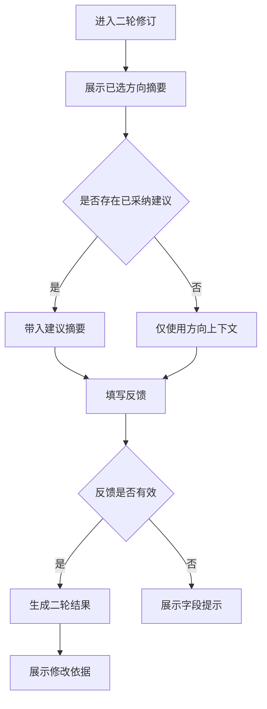
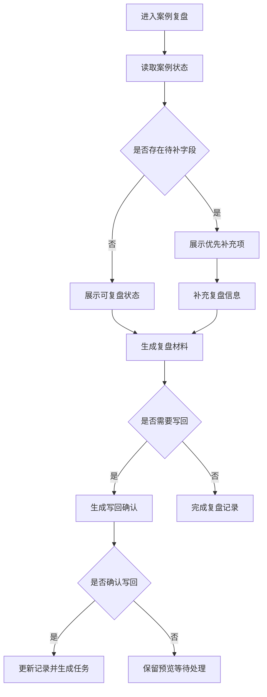

# 背景

AI封面创意助手当前已经具备首轮方向卡、二轮反馈、规则引擎、真实案例、批次复盘和 Obsidian 导出能力。现有能力已经通过测试基线验证，但页面主路径仍偏项目验证台，用户进入后需要同时理解输入、解释、案例、复盘等多个目标，核心操作焦点不够集中。

本次 MVP 重做的目标，是在保留现有规则、案例、导出和测试资产的基础上，把产品重新收束为一条清晰主路径：输入准备、首轮方向判断、工作区深化、二轮修订、案例复盘与规则沉淀。重做范围不包含新建 Web v2、接入真实生图模型、重写 Obsidian 导出底层、推翻现有规则引擎或重建测试体系。

# 产品特性

### 1.输入准备

#### 1.1.功能背景

输入准备用于承接用户已有的内容想法、素材状态和封面倾向。该功能的目标是降低启动成本，让用户不需要先描述完整封面方案，也能进入首轮方向判断。

#### 1.2.用户场景

用户准备制作短视频或图文封面，已有内容主题、内容目标或本地截图，但不确定封面应走信息感、结果感、悬念感、冲突感还是质感方向。用户希望先输入基础信息，由系统生成可比较的封面方向。

#### 1.3.前置条件

用户进入主工作台。页面已加载输入准备区、素材预览区和生成动作区。系统保留现有首轮分析能力。

#### 1.4.业务流程

#### 1.5.字段规则与校验

| 字段 | 需求描述 |
| --- | --- |
| 内容主题 | 1. 是否必填：必填。 a. 为空时，点击生成后在字段附近提示“请输入内容主题”，不发起生成，已填内容保留。 2. 占位文案：“例如：为什么总觉得很忙却没有结果”。 3. 校验规则：默认值为无默认值；去除首尾空格；最多 80 个字符。 a. 超长时禁止继续输入或截断粘贴，并在字段附近提示“内容主题最多输入 80 个字符”。 |
| 内容目标 | 1. 是否必填：必填。 a. 为空时，点击生成后在字段附近提示“请输入内容目标”，不发起生成，已填内容保留。 2. 占位文案：“例如：让用户意识到忙碌不等于有效产出”。 3. 校验规则：默认值为无默认值；去除首尾空格；最多 120 个字符。 a. 超长时禁止继续输入或截断粘贴，并在字段附近提示“内容目标最多输入 120 个字符”。 |
| 目标平台 | 1. 是否必填：必填。 a. 未选择时，点击生成后在字段附近提示“请选择目标平台”，不发起生成。 2. 占位文案：“请选择目标平台”。 3. 校验规则：默认值为“抖音”；仅支持从枚举值中选择。 a. 选项不可用时，点击生成后展示全局吐司“目标平台不可用，请重新选择”。 4. 枚举值：抖音、小红书、Instagram。 |
| 素材类型 | 1. 是否必填：必填。 a. 未选择时，点击生成后在字段附近提示“请选择素材类型”，不发起生成。 2. 占位文案：“请选择素材类型”。 3. 校验规则：默认值为“截图”；仅支持从枚举值中选择。 4. 枚举值：截图、人像、场景图、商品图、无图只有想法。 |
| 上传图片 | 1. 是否必填：非必填。 2. 占位文案：“上传本地参考图或截图”。 3. 校验规则：默认值为无默认值；仅支持图片文件；单次最多上传 1 张。 a. 文件类型不支持时，在上传区域提示“仅支持图片文件”，已填文本内容保留。 |
| 素材描述 | 1. 是否必填：非必填；当未上传图片时建议填写。 2. 占位文案：“例如：口播截图，人物在左侧，背景比较空”。 3. 校验规则：默认值为无默认值；支持换行；最多 300 个字符。 a. 超长时禁止继续输入或截断粘贴，并在字段附近提示“素材描述最多输入 300 个字符”。 |
| 封面倾向 | 1. 是否必填：非必填。 2. 占位文案：“例如：更高级一点，但不要太平”。 3. 校验规则：默认值为无默认值；去除首尾空格；最多 120 个字符。 a. 超长时禁止继续输入或截断粘贴，并在字段附近提示“封面倾向最多输入 120 个字符”。 |
| 补充说明 | 1. 是否必填：非必填。 2. 占位文案：“例如：想更像热门内容，但不要太营销化”。 3. 校验规则：默认值为无默认值；支持换行；最多 300 个字符。 a. 超长时禁止继续输入或截断粘贴，并在字段附近提示“补充说明最多输入 300 个字符”。 |

#### 1.6.业务规则

生成动作点击前必须完成内容主题、内容目标、目标平台、素材类型校验。提交中禁用生成动作，避免重复提交。加载结构化样例时，只填充输入区字段和素材说明，不覆盖用户已上传的本地图片。清除素材后，仅清空上传图片与素材预览，不清空文本输入。

#### 1.7.后置条件

生成成功后，页面展示首轮方向结果，并保留本次输入用于后续工作区和二轮修订。生成失败后，页面保留输入内容和素材预览，并允许用户调整后重试。

#### 1.8.功能异常场景

- 服务端失败：展示全局吐司“生成失败，请重试”，输入内容保留，生成动作恢复可点击。
- 网络异常：展示全局吐司“网络异常，请稍后重试”，输入内容保留，用户可再次点击生成。
- 重复提交：提交中保持生成动作禁用，不重复发起生成。

### 2.首轮方向判断

#### 2.1.功能背景

首轮方向判断用于把用户输入转化为三个可比较的封面策略。该功能不是输出终稿封面，而是先帮助用户判断哪种点击机制更适合当前内容。

#### 2.2.用户场景

用户完成输入后，需要快速看到三个方向的差异，包括封面大字、标题建议、配图路径、适用理由和风险提醒，从而选择一个方向继续深化。

#### 2.3.前置条件

用户已完成输入准备并成功触发生成。系统可基于现有规则引擎输出三个方向卡。

#### 2.4.业务流程

#### 2.5.字段规则与校验

| 字段 | 需求描述 |
| --- | --- |
| 方向选择 | 1. 是否必填：进入工作区或二轮修订前必填。 2. 校验规则：默认值为无默认值；仅支持从当前生成的三张方向卡中选择。 a. 未选择方向时点击后续动作，在结果区提示“请先选择一个封面方向”。 |

#### 2.6.业务规则

每次首轮生成固定展示三张方向卡。方向卡必须包含方向名称、点击机制、封面大字、标题建议、配图建议、适用理由、命中信号和风险提醒。方向卡可切换选中态，后续动作必须使用当前选中方向作为上下文。重新生成首轮结果后，旧方向选中态失效。

#### 2.7.后置条件

用户选中方向后，页面展示工作区深化入口和二轮修订入口。系统保留本次首轮结果，用于后续建议生成、二轮反馈和案例记录。

#### 2.8.功能异常场景

- 结果生成失败：展示全局吐司“方向结果生成失败，请重试”，保留输入区内容。
- 结果数据不完整：展示全局吐司“方向结果不完整，请重新生成”，不允许进入后续动作。
- 方向不存在：用户触发已失效方向时，提示“当前方向已失效，请重新选择”。

### 3.工作区深化

#### 3.1.功能背景

工作区深化用于把首轮方向转化为更具体的执行任务。该功能承接用户对素材路径的选择，使结果从“方向建议”推进到“下一步操作建议”。

#### 3.2.用户场景

用户选中一个封面方向后，需要判断应优先优化现有素材、补内容贴合图，还是做创意概念图，并希望获得更具体的任务说明和风险检查。

#### 3.3.前置条件

用户已生成首轮方向结果，并选择一个方向。页面已展示工作区路径入口。

#### 3.4.业务流程

#### 3.5.字段规则与校验

| 字段 | 需求描述 |
| --- | --- |
| 工作区路径 | 1. 是否必填：必填。 2. 占位文案：“请选择下一步处理路径”。 3. 校验规则：默认值依据首轮配图策略推荐；仅支持从枚举值中选择。 4. 枚举值：优化现有素材、补内容贴合图、做创意概念图。 |
| 路径内输入 | 1. 是否必填：生成工作区建议前至少填写 1 项。 2. 占位文案：根据当前路径展示对应输入提示。 3. 校验规则：默认值为无默认值；单项最多 200 个字符；支持清空后重新填写。 a. 未填写任何路径内输入时，点击生成建议后在工作区提示“请补充至少一项路径信息”。 |
| 建议反馈 | 1. 是否必填：非必填。 3. 校验规则：默认值为无默认值；仅在建议生成后可选择；同一条建议仅保留一个当前反馈状态。 4. 状态说明：已采纳、暂不采纳。 |

#### 3.6.业务规则

工作区路径必须基于当前选中方向展开。切换路径时，保留首轮方向上下文，并刷新路径内输入提示。生成建议时禁用重复点击。建议生成后才展示采纳和暂不采纳动作。采纳建议后，二轮修订可读取建议摘要作为上下文。暂不采纳后，建议内容保留，用户可修改路径内输入后重新生成。

#### 3.7.后置条件

建议采纳后，工作区进入已采纳状态，并展示进入二轮修订的动作。暂不采纳后，页面保留当前建议和输入，提示用户调整后重新生成。

#### 3.8.功能异常场景

- 未选择方向：提示“请先选择一个封面方向”，不展示路径输入。
- 建议生成失败：展示全局吐司“建议生成失败，请重试”，路径内输入保留。
- 重复生成：生成中禁用建议生成动作，不重复发起请求。

### 4.二轮修订

#### 4.1.功能背景

二轮修订用于接住用户对首轮方向或工作区建议的主观反馈，将模糊表达转化为可执行的封面策略调整。

#### 4.2.用户场景

用户对某个方向基本认可，但希望调整风格强度、降低营销感、强化质感或补充悬念，希望系统基于一句反馈生成更贴近意图的二轮结果。

#### 4.3.前置条件

用户已选择首轮方向。若用户已采纳工作区建议，则二轮修订默认带入该建议摘要。

#### 4.4.业务流程

#### 4.5.字段规则与校验

| 字段 | 需求描述 |
| --- | --- |
| 修订反馈 | 1. 是否必填：必填。 a. 为空时，点击修订后在字段附近提示“请输入修改意见”。 2. 占位文案：“例如：更高级一点，但不要太平”。 3. 校验规则：默认值为无默认值；去除首尾空格；最多 200 个字符。 a. 超长时禁止继续输入或截断粘贴，并在字段附近提示“修改意见最多输入 200 个字符”。 |

#### 4.6.业务规则

二轮修订必须基于当前选中方向生成。若存在已采纳工作区建议，系统优先把建议摘要作为修订上下文。系统应识别用户反馈中的保留项和修改项，并在结果中展示修改依据。修订中禁用重复提交。重新选择首轮方向后，旧二轮结果失效。

#### 4.7.后置条件

修订成功后，页面展示二轮结果、修改依据、封面大字、标题建议、配图方向和风险提醒。用户可继续返回工作区调整，也可进入案例复盘记录。

#### 4.8.功能异常场景

- 未选择方向：展示提示“请先选择一个封面方向”，不发起修订。
- 修订失败：展示全局吐司“修订失败，请重试”，反馈内容保留。
- 上下文失效：展示全局吐司“当前结果已失效，请重新生成方向”。

### 5.案例复盘与规则沉淀

#### 5.1.功能背景

案例复盘与规则沉淀用于把真实案例、批次试跑和人工复盘接回产品主线，使每次使用结果都能成为后续规则优化依据。

#### 5.2.用户场景

用户需要查看真实案例缺口、补充复盘字段、生成批次看板、确认写回结果，并将高频问题转化为后续规则修订任务。

#### 5.3.前置条件

系统已有真实案例或平台案例数据。用户从主工作台的案例复盘入口进入，或从二轮结果后的记录入口进入。

#### 5.4.业务流程

#### 5.5.字段规则与校验

| 字段 | 需求描述 |
| --- | --- |
| 案例选择 | 1. 是否必填：必填。 2. 占位文案：“请选择需要复盘的案例”。 3. 校验规则：默认按待处理优先展示；仅支持选择系统已有案例。 a. 案例不存在或已失效时，展示全局吐司“案例不可用，请刷新后重试”。 |
| 人工复盘结论 | 1. 是否必填：生成正式写回前必填。 2. 占位文案：“请输入本次人工复盘结论”。 3. 校验规则：默认值为无默认值；支持换行；最多 500 个字符。 a. 为空时，点击正式写回前在字段附近提示“请输入人工复盘结论”。 |
| 写回确认 | 1. 是否必填：正式写回前必填。 3. 校验规则：默认值为无默认值；仅支持在写回预览生成后选择。 4. 状态说明：未确认、已确认。 |

#### 5.6.业务规则

案例复盘默认优先展示待补字段较多或近期待处理的案例。正式写回前必须先生成写回预览，并获得写回确认。未确认写回时，不修改目标记录。批次复盘结果可生成规则修订任务，但不自动修改规则引擎。导出或写回失败时，原案例状态保持不变。

#### 5.7.后置条件

复盘材料生成成功后，页面展示导出状态和下一步建议。正式写回成功后，目标记录更新，并形成规则修订或关键样例复跑任务。

#### 5.8.功能异常场景

- 案例读取失败：展示全局吐司“案例读取失败，请重试”，页面保留入口。
- 导出失败：展示全局吐司“导出失败，请重试”，复盘内容保留。
- 写回未确认：展示提示“请先确认写回内容”，不执行正式写回。
- 写回失败：展示全局吐司“写回失败，请检查后重试”，目标记录保持原状态。
